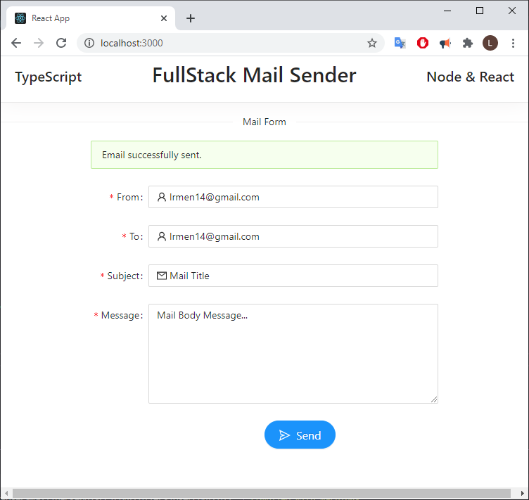
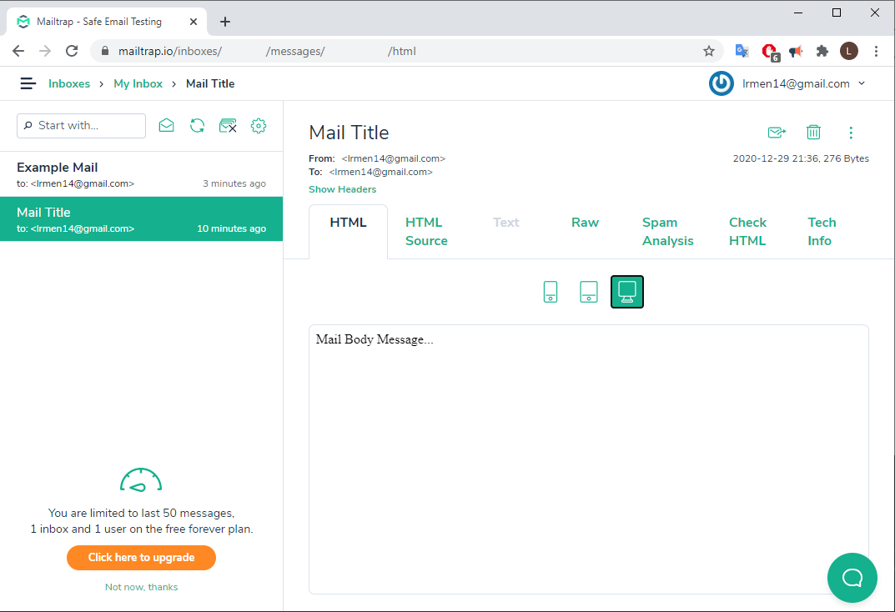
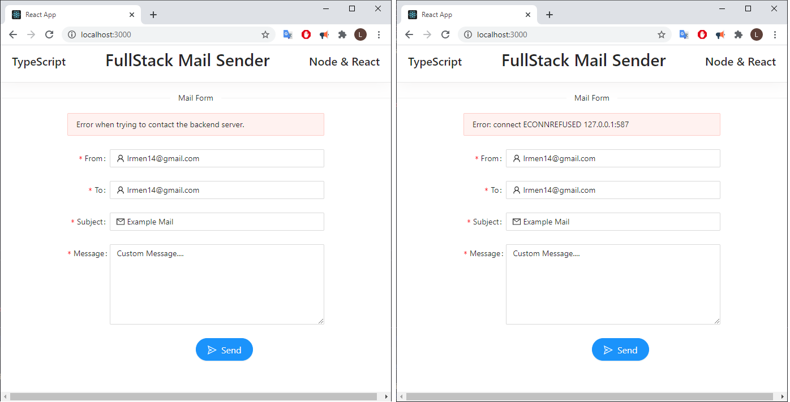

## FullStack Typescript Mail Sender
A Full Stack Mail System built in React and Node, using the <a href="https://nodemailer.com/">NodeMailer</a> library and the free plan of <a href="http://mailtrap.io">MailTrap</a> service.

The project provides a front-end interface in React, allowing the user to fill out an email form in a pleasant and functional way.

The back-end interface uses nodemailer and to send emails with nodeJS.

#### Front-End Technologies
  - React
  - TypeScript
  - Ant Design

#### Back-End Technologies

- NodeJS
- TypeScript
- NodeMailer

### Running

1. You must edit the <b>configs.ts</b> file found in the <b>"backend/src/configs"</b> folder with your account data from <a href="http://mailtrap.io">MailTrap</a> or another mail service.
    - It's a simple process, just register a free account and get the data from the server sending emails and user data
 
2. To run the system, it is necessary to execute the commands:
    - In the backend folder: <b>yarn install</b> folder and then <b>yarn dev: server</b>
    - In the frontend folder: <b>yarn install</b> folder and then <b>yarn start</b>

### Interfaces

### Successful email sending

#### MailBox from <a href="http://mailtrap.io">MailTrap</a> (Showing successful email sending)

#### Error handling (with Ant Design Alerts)
